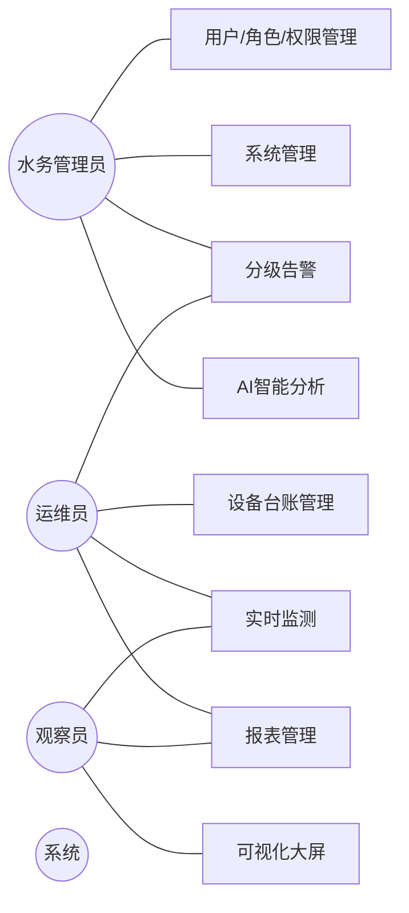

# 第3章 系统需求分析

本章结合水务运维业务实际，从业务需求、功能需求和非功能需求三个层面系统分析本系统的建设目标，并通过用例图刻画各类角色与系统功能之间的交互关系，为第4章的系统设计和第5章的系统实现提供依据。

## 3.1 业务需求分析

### 3.1.1 业务流程梳理

中小型供水单位（县城、园区水厂）的日常水务运维主要包括**实时监控、设备台账、异常处置、报表统计**四条主线：

1. **实时监控**：传感器（压力、流量、水质、液位）周期性采集管网数据，运维人员需实时掌握管网运行状态，掌握水压是否正常、流量是否超标、水质是否合格。
2. **设备台账**：对泵站、管道、水质分析仪、液位计等设备进行统一登记，记录设备编号、型号、安装位置、所属片区、投运日期等基础信息，并跟踪设备在线/离线/故障状态。
3. **异常告警处置**：当监测值超出设定阈值或出现异常波动时，系统应自动产生分级告警；运维人员接收告警、定位根因、填写处理结果，形成"采集—研判—处置—归档"的闭环。
4. **报表与决策**：按日/周/月或自定义时段生成监测数据报表，供管理层评估供水安全、漏损与节能效果。

### 3.1.2 用户角色与核心诉求

结合调研，系统面向三类用户，其业务场景与核心诉求如下：

| 角色 | 典型业务场景 | 核心诉求 |
|---|---|---|
| 水务管理员 | 平台整体运营、账号与权限分配、告警规则配置、报表审批 | 全局管控、精细授权、掌握全局运行态势 |
| 运维员 | 设备台账维护、实时监测、异常告警处置、数据导出 | 快速发现问题、便捷处理工单、操作门槛低 |
| 观察员 | 查看大屏、查看监测数据与报表 | 只读、直观、无需登录即可大屏投屏 |

### 3.1.3 现状痛点与解决思路

针对第1章绪论归纳的六大痛点（单表查询性能差、告警缺乏智能研判、SQL门槛高、业务与AI耦合、依赖Linux、权限粗糙），本系统的解决思路分别为：**时序数据按月分表存储、AI微服务独立负责智能分析、NL2SQL自然语言查询、前后端分离+跨语言微服务、Windows一键部署、RBAC精细权限与一体化大屏**。

## 3.2 功能性需求分析

系统按职能划分为八大功能模块：用户权限管理、设备台账管理、实时监测、分级告警、AI智能分析、报表管理、可视化大屏、系统管理。

### 3.2.1 用户权限管理模块

- 用户注册、登录与退出（JWT 令牌无状态认证）；
- 角色分配（水务管理员/运维员/观察员三级）；
- 基于 RBAC 的菜单权限与按钮权限控制；
- 用户启用/禁用、修改密码。

### 3.2.2 设备台账管理模块

- 设备信息的录入、编辑、查询（分页/关键字）与删除；
- 设备分类（压力/流量/水质/液位）与状态管理；
- 设备在线数量统计、经纬度与片区归属管理。

### 3.2.3 实时监测模块

- 管网压力、流量、pH、浊度、余氯、温度、液位等指标的实时采集与展示；
- 监测数据实时推送（WebSocket）；
- 指定设备与指标的时序趋势曲线查询；
- 运行统计分析（均值、总量等）。

### 3.2.4 分级告警模块

- 告警规则配置：阈值型（min/max）、趋势型、异常型；级别（提示/警告/严重）；
- 告警触发与持续窗口判定；
- 告警轮询、实时推送与滚动展示；
- 告警处理流程（未处理→处理中→已处理/已忽略）与处理结果记录；
- 告警统计（分级数量、待处理数量）与趋势。

### 3.2.5 AI智能分析模块

- NL2SQL 自然语言查数：用户以中文提问，系统自动生成 SQL 并返回图表/表格；
- 数据清洗：自动识别并修复/剔除异常值；
- 管网异常分析：基于时序数据的离群检测；
- AI 调用日志：记录问题、生成 SQL、耗时与引擎，便于追溯与审计。

### 3.2.6 报表管理模块

- 日报/周报/月报/自定义时段报表生成；
- 报表导出（CSV）；
- 报表列表与汇总统计。

### 3.2.7 可视化大屏模块

- 全局关键指标（平均水压、总流量、平均 pH 等）看板；
- 片区管网拓扑与空间分布；
- 水质综合指标仪表盘、设备状态分布、实时告警滚动列表；
- 支持 WebSocket 实时刷新，适合投屏。

### 3.2.8 系统管理模块

- 用户管理（增删改查、启停、分配角色）；
- 角色管理（创建角色、为角色授权菜单）；
- 设备类型维护、平台基础统计。

## 3.3 非功能性需求分析

### 3.3.1 性能需求
- 常规列表/查询接口响应时间 ≤ 500ms；趋势曲线查询 ≤ 1s；
- 在十万级时序数据量下，趋势聚合查询耗时较单表方案明显下降；
- 支持多用户并发访问平稳运行。

### 3.3.2 安全性需求
- 用户口令 BCrypt 加密存储，登录认证基于 JWT，非法令牌拦截；
- 接口级 `@PreAuthorize` 权限校验，杜绝越权访问；
- 分表表名白名单校验，防止 SQL 注入。

### 3.3.3 可用性需求
- WebSocket 断线自动重连，保证实时数据不中断；
- 系统具备统一异常处理与友好提示。

### 3.3.4 可维护性需求
- 前后端分离、业务与 AI 逻辑解耦，模块低耦合易扩展；
- 统一 RESTful API 契约与统一返回体（Result）。

### 3.3.5 可部署性需求
- 支持 **Windows 单机一键部署**（Java + Python + 前端），降低对 Linux 运维环境依赖；
- 脚本化一键启停，降低中小水务企业运维门槛。

## 3.4 用例分析

### 3.4.1 系统用例图

### 3.4.2 主要用例描述

**用例 UC-01：登录认证**

| 项目 | 描述 |
|---|---|
| 参与者 | 水务管理员、运维员、观察员 |
| 前置条件 | 账号已创建且状态为启用 |
| 主流程 | ①输入用户名/密码→②JWT 签发→③返回用户信息与菜单→④进入主界面 |
| 备选流程 | 密码错误提示"用户名或密码错误"；账号禁用提示禁止登录 |
| 后置条件 | 携带 token 访问受保护接口 |

**用例 UC-02：实时监测查看**

| 项目 | 描述 |
|---|---|
| 参与者 | 运维员、观察员 |
| 主流程 | ①打开实时监测页→②展示各设备最新压力/流量/水质→③WebSocket 自动刷新最新数值→④点选设备指标查看趋势 |
| 后置条件 | 大屏与监测页数据实时一致 |

**用例 UC-03：告警处置**

| 项目 | 描述 |
|---|---|
| 参与者 | 运维员（处理）、水务管理员（规则配置） |
| 主流程 | ①管理员配置阈值/趋势/异常规则→②定时任务监测→③触发后产生分级告警并推送→④运维员认领：填写处理结果→⑤归档 |
| 后置条件 | 告警状态流转为"已处理/已忽略"，大屏告警列表同步更新 |

**用例 UC-04：NL2SQL 自然语言查数**

| 项目 | 描述 |
|---|---|
| 参与者 | 水务管理员、运维员 |
| 主流程 | ①输入中文问题→②AI 微服务解析意图生成 SQL→③执行并返回图表/表格→④记录 AI 日志 |
| 后置条件 | 非 SQL 使用者也能自助取数 |