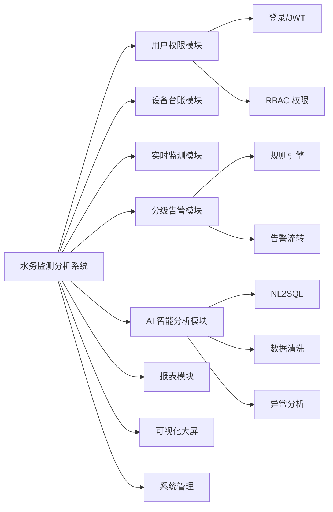
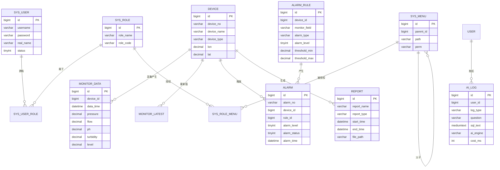
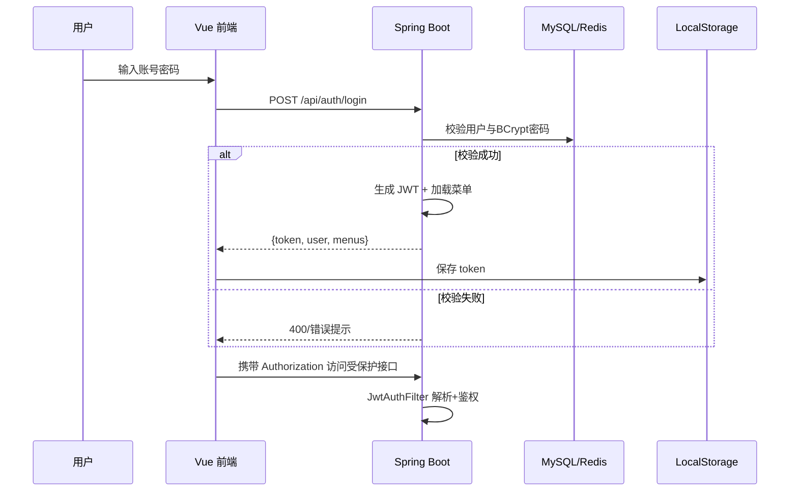
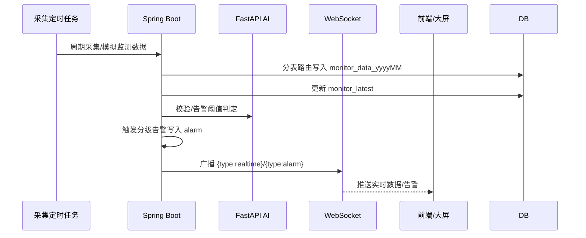
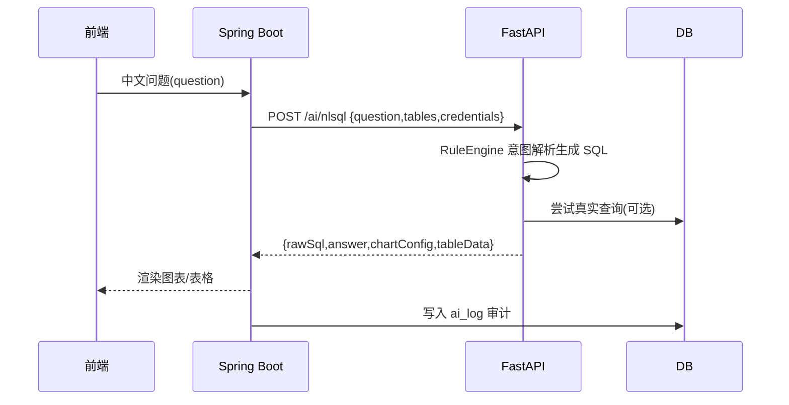

# 第4章 系统设计

本章在需求分析的基础上，给出系统的总体架构、功能模块划分、数据库设计、时序分表方案、接口设计以及核心交互流程设计，为第5章的系统实现提供蓝图。

## 4.1 系统总体架构设计

### 4.1.1 总体架构

系统采用**前后端分离 + 跨语言微服务**的分层架构，自下而上分为**存储层、AI 服务层、业务层、表示层、部署支撑层**五层：

```mermaid
flowchart TB
  subgraph L1["表示层 (Vue 3)"]
    A1["管理后台(Element Plus)"]
    A2["可视化大屏(ECharts)"]
    A3["WebSocket 实时刷新"]
  end

  subgraph L2["网关/代理层 (Nginx / Vite)")
    B1["静态资源 + /api 反向代理 + /ws 转发"]
  end

  subgraph L3["业务层 (Spring Boot 3.2)"]
    C1["认证鉴权(JWT+RBAC)"]
    C2["设备台账"]
    C3["实时监测"]
    C4["分级告警"]
    C5["报表"]
    C6["WebSocket 推送"]
    C7["AI 客户端(AiClient, HTTP/1.1)"]
  end

  subgraph L4["AI 服务层 (Python FastAPI)"]
    D1["NL2SQL 规则引擎"]
    D2["数据清洗"]
    D3["管网异常分析"]
  end

  subgraph L5["存储层"]
    E1["MySQL 5.7(时序按月分表)"]
    E2["Redis 缓存/消息"]
  end

  L1 --> L2 --> L3
  L3 --> C7 --> L4
  L3 --> L5
  L4 --> L5
  C3 --> C6
  C6 -. WebSocket .-> L1
```

各层职责：
- **表示层**：Vue 3 提供管理后台与科技感大屏，ECharts 负责图表渲染；
- **网关层**：Nginx 托管前端静态资源，将 `/api` 反向代理到后端、`/ws` 升级转发到 WebSocket，保持前后端同源；
- **业务层**：Spring Boot 承担核心业务、RBAC 权限与实时推送，并作为唯一对外接口提供方；
- **AI 服务层**：Python FastAPI 独立承载数据清洗、NL2SQL 与异常分析等 AI 能力，通过 HTTP 与业务层解耦，便于独立演进与替换为大模型；
- **存储层**：MySQL 存储业务与时序数据（按月分表），Redis 承担缓存与消息中转。

### 4.1.2 技术选型

| 层次 | 技术 | 版本 | 说明 |
|---|---|---|---|
| 后端 | Spring Boot | 3.2.x | 自动配置、内嵌 Tomcat |
| 后端 | MyBatis-Plus | 3.x | ORM、代码生成 |
| 后端 | Spring Security + JWT | — | 认证鉴权 |
| AI | Python FastAPI | 3.8+ | 类型校验、自动文档 |
| 前端 | Vue 3 + Vite | ^3.5 / ^5 | 组合式 API |
| 前端 | Element Plus / ECharts | — | UI 组件与图表 |
| 数据 | MySQL 5.7 / Redis | — | 主库 / 缓存 |

## 4.2 功能模块设计

系统按职责划分为如下模块，模块间低耦合、单一职责：



- **用户权限模块**：基于 RBAC（用户—角色—菜单三层），JWT 无状态认证，`@PreAuthorize` 接口级校验；
- **实时监测模块**：定时采集任务 + 时序分表写入 + WebSocket 推送；
- **分级告警模块**：规则配置 + 分钟级轮询判定 + 分级告警 + 闭环处理；
- **AI 模块**：通过 AiClient 跨语言调用 FastAPI，失败自动降级保证可用性。

## 4.3 数据库设计

### 4.3.1 概念结构设计（E-R 图）

系统核心实体包括：用户(User)、角色(Role)、菜单(Menu)、设备(Device)、告警规则(AlarmRule)、告警记录(Alarm)、监测数据(MonitorData)、AI 日志(AiLog)、报表(Report)。



### 4.3.2 逻辑结构设计（数据字典要点）

系统共 15 张核心表，主要数据字典如下（字段完整定义见 `sql/shuiwu.sql`）：

**（1）用户表 sys_user**

| 字段 | 类型 | 说明 |
|---|---|---|
| id | BIGINT PK | 主键 |
| username | VARCHAR(50) UNIQUE | 登录名 |
| password | VARCHAR(128) | BCrypt 加密 |
| real_name / phone / email | VARCHAR | 基础信息 |
| status | TINYINT | 1 启用 0 禁用 |
| create_time / update_time | DATETIME | 时间戳 |

**（2）角色表 sys_role / 菜单表 sys_menu / 关联表**

- `sys_role`：role_name、role_code（ADMIN/OPERATOR/VIEWER）；
- `sys_menu`：parent_id（目录）、path、component、perm（如 `sys:user:list`）、menu_type（目录1/菜单2/按钮3）；
- `sys_user_role`、`sys_role_menu`：实现多对多 RBAC。

**（3）设备表 device**

| 字段 | 类型 | 说明 |
|---|---|---|
| device_no | VARCHAR(50) | 设备编号，如 PT-001 |
| device_name | VARCHAR(100) | 设备名称 |
| device_type | VARCHAR(30) | pressure/flow/quality/level |
| location / area | VARCHAR | 安装位置 / 所属片区 |
| model / manufacturer | VARCHAR | 型号 / 厂商 |
| status | TINYINT | 1 在线 0 离线 2 故障 3 停用 |
| lon / lat | DECIMAL(10,6) | 经纬度（大屏打点） |

**（4）告警规则表 alarm_rule 与告警记录表 alarm**

- `alarm_rule`：device_id（空=全局）、monitor_field、alarm_type（threshold/trend/anomaly）、alarm_level（1提示/2警告/3严重）、threshold_min/max、window_minutes；
- `alarm`：alarm_no、device_id、rule_id、current_value、alarm_status（0未处理/1处理中/2已处理/3已忽略）、alarm_time、handle_user/handle_time/handle_result。

**（5）AI 日志表 ai_log**：log_type（nlsql/clean/anomaly）、question、sql_text、answer、ai_engine、cost_ms、success。

**（6）报表表 report**：report_name、report_type（daily/weekly/monthly/custom）、start_time/end_time、file_path、summary。

**（7）实时最新值表 monitor_latest**：以 device_id 为主键，冗余设备最新压力/流量/pH/浊度/余氯/温度/液位等，供大屏快速读取。

### 4.3.3 时序数据分表方案

针对管网压力、流量、水质等**高频、量大、按时间聚合查询**的时序数据，采用**基于时间维度的按月分表**策略：

1. **命名规则**：物理表名 `monitor_data_YYYYMM`（如 `monitor_data_202608`）；
2. **建表方式**：数据库存储过程 `create_monitor_table(y,m)` 按月自动建表，后端定时任务（`TimeShardInitJob`）预建未来月份表；
3. **路由机制**：后端 `TableRouter.resolve(dataTime)` 依据 `dataTime` 格式化为 `yyyyMM` 拼出物理表名；写入/查询统一按路由结果动态操作，避免单表膨胀；
4. **安全防护**：`TableRouter.check()` 以 `^monitor_data_\d{6}$` 白名单正则校验表名，从源头杜绝拼接注入；
5. **索引设计**：联合索引 `(device_id, data_time)`，支撑按设备+时间窗口的高效聚合。

该方案将单表数据量分割为"每月一张表"，使单表规模可控、索引高效，有效解决数据量增长导致的查询卡顿问题。

## 4.4 接口设计

### 4.4.1 前后端 RESTful 接口规范

系统统一返回体 `Result`：

```json
{ "code": 200, "message": "success", "data": { } }
```

主要接口如下：

| 模块 | 方法 | 路径 | 说明 |
|---|---|---|---|
| 认证 | POST | /api/auth/login | 登录，签发 JWT |
| 认证 | GET | /api/auth/me | 当前用户信息+菜单 |
| 用户 | GET/POST | /api/system/user* | 用户分页/新增/启停/删除 |
| 角色 | GET | /api/system/role/list | 角色列表 |
| 菜单 | GET | /api/system/menu/tree | 权限菜单树 |
| 设备 | GET | /api/device/page | 设备分页 |
| 设备 | GET | /api/device/onlineCount | 在线数量 |
| 监测 | GET | /api/monitor/realtime | 实时监测 |
| 监测 | GET | /api/monitor/trend | 趋势曲线 |
| 监测 | GET | /api/monitor/stat | 运行统计 |
| 告警 | GET | /api/alarm/page | 告警分页 |
| 告警 | GET/POST | /api/alarm/rule* | 规则列表/新增 |
| 告警 | GET | /api/alarm/summary | 分级统计 |
| 告警 | POST | /api/alarm/handle | 告警处理 |
| AI | POST | /api/ai/nlsql | 自然语言查数 |
| AI | POST | /api/ai/clean | 数据清洗 |
| AI | GET | /api/ai/anomaly | 异常分析 |
| AI | GET | /api/ai/log/page | AI 日志 |
| 报表 | POST | /api/report/generate | 生成报表 |
| 报表 | GET | /api/report/{id}/download | 下载报表 |

### 4.4.2 跨语言 AI 服务接口设计

业务层通过 `AiClient`（HTTP/1.1，显式避免 h2c 升级导致请求体丢失）调用 AI 微服务：

| 接口 | 请求 | 返回 |
|---|---|---|
| POST /ai/nlsql | {question, tables, credentials} | {success, rawSql, answer, chartConfig, tableData} |
| POST /ai/clean | {deviceId, field, rows} | {cleaned, repaired, removed, detail} |
| POST /ai/anomaly | {deviceId, topN, series[]} | {anomalies[]} |

AI 服务调用采用**降级策略**：任一环节异常时，业务层回退到本地 `RuleCenter` 规则引擎或静态说明，保证主流程（尤其是大屏实时展示）不受 AI 服务波动影响。

## 4.5 核心交互流程设计

### 4.5.1 登录认证时序图



### 4.5.2 实时监测与告警推送流程



### 4.5.3 NL2SQL 交互流程

