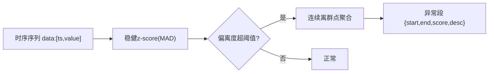

# 第5章 系统实现

本章介绍系统的开发环境与关键功能实现。按照"后端业务模块—AI微服务—前端页面—Windows部署"的顺序，给出各模块的关键实现思路与核心代码。

## 5.1 开发环境与工程结构

### 5.1.1 开发环境

| 类别 | 技术/版本 |
|---|---|
| 操作系统 | Windows 10/11（部署）、Linux（开发） |
| 后端 | JDK 17、Maven 3.9、Spring Boot 3.2 |
| AI 服务 | Python 3.8+、FastAPI、uvicorn |
| 前端 | Node.js 18+、Vue 3.5、Vite 5 |
| 数据库 | MySQL 5.7、Redis |
| 构建/部署 | Maven、Vite、Nginx（可选）、批处理脚本 |

### 5.1.2 工程结构

```
shuiwu/
├── backend/            # Spring Boot 后端
│   └── src/main/java/com/water/
│       ├── controller/  # REST 控制器
│       ├── service/     # 业务逻辑
│       ├── mapper/      # MyBatis-Plus
│       ├── ai/          # AI 客户端与规则降级
│       ├── websocket/   # 实时推送
│       ├── timeshard/   # 时序分表路由
│       ├── job/         # 定时任务(采集/告警/建表)
│       ├── security/    # JWT + 权限
│       └── config/      # 配置
├── ai-service/          # Python FastAPI 微服务
├── frontend/            # Vue 3 前端
├── deploy/              # Windows 一键启停脚本 + nginx
├── sql/shuiwu.sql       # 建库建表与初始化数据
└── docs/                # 文档
```

## 5.2 后端业务模块实现

### 5.2.1 用户认证与权限管理实现

**核心类**：`JwtUtil`、`JwtAuthFilter`、`SecurityConfig`、`AuthServiceImpl`。

- 登录成功后签发 JWT（过期时间可配置，默认 720 分钟），并将用户信息与角色写入令牌；
- `JwtAuthFilter` 为继承 `OncePerRequestFilter` 的过滤器，从 `Authorization: Bearer <token>` 解析并注入安全上下文；
- `SecurityConfig` 关闭 CSRF、开启 CORS（`allowedOriginPatterns("*")` 适配内网多端口）、采用无状态会话，放行 `/api/auth/login` 与 `/ws/**`；
- 接口级权限通过 `@PreAuthorize("hasAnyAuthority('ADMIN',...PermissionService' sys:user:list')")` 校验，实现粗粒度角色 + 细粒度菜单权限两级控制。

```java
@Bean
public SecurityFilterChain filterChain(HttpSecurity http) throws Exception {
    http.csrf(csrf -> csrf.disable())
        .cors(cors -> cors.configurationSource(corsConfigurationSource()))
        .sessionManagement(sm -> sm.sessionCreationPolicy(SessionCreationPolicy.STATELESS))
        .authorizeHttpRequests(auth -> auth
            .requestMatchers("/api/auth/login", "/ws/**", "/error").permitAll()
            .anyRequest().authenticated())
        .addFilterBefore(jwtAuthFilter, UsernamePasswordAuthenticationFilter.class);
    return http.build();
}
```

### 5.2.2 设备台账管理实现

`DeviceController` + `DeviceServiceImpl` 提供设备分页查询、新增、编辑、删除与在线数量统计。设备类型统一为 `pressure/flow/quality/level`，冗余 `monitor_latest` 表维护各设备最新监测值，供监测与告警快速读取。

### 5.2.3 数据采集与分表写入实现

**核心类**：`MonitorDataSimJob`（模拟采集）、`MonitorMapper`、`TableRouter`、`TimeShardInitJob`。

- **分表路由**：写入/查询前以 `data_time` 计算 `monitor_data_yyyyMM` 物理表名，`TableRouter.check()` 做白名单校验：

```java
public static String resolve(LocalDateTime time) {
    return TABLE_PREFIX + time.format(FMT);         // monitor_data_202608
}
public static String check(String tableName) {
    if (tableName == null || !SAFE_PATTERN.matcher(tableName).matches())
        throw new IllegalArgumentException("非法分表名: " + tableName);
    return tableName;
}
```

- **定时建表**：`TimeShardInitJob` 调用数据库存储过程 `create_monitor_table(y,m)` 预建未来月份分表，避免跨月写入失败；
- **实时采集**：模拟采集任务按秒级频次生成压力/流量/pH/浊度/余氯/温度/液位数据，数据落库的同时更新 `monitor_latest` 并触发 WebSocket 推送。

### 5.2.4 分级告警引擎实现

**核心类**：`AlarmCheckJob`、`AlarmServiceImpl`、`alarm_rule`。

- 规则支持阈值型（min/max）、趋势型、异常型三类型，级别 1/2/3；
- 定时任务轮询各规则，结合 `window_minutes` 持续窗口判定，触发后生成 `alarm_no` 并写入告警表、广播告警事件；
- 提供告警处理接口，实现"未处理→处理中→已处理/已忽略"状态流转，并记录处理人/时间/结果。

### 5.2.5 报表生成实现

`ReportServiceImpl` 支持日报/周报/月报/自定义时段，生成 CSV 报表文件（`reports/`）并登记报表记录，提供下载接口。

### 5.2.6 WebSocket 实时推送实现

**核心类**：`WebSocketConfig`、`WaterWebSocketHandler`、`WebSocketInterceptor`、`WebSocketSessionManager`。

- 建立 `/ws` 端点的握手拦截，校验 JWT token 后放行；
- `SessionManager` 维护在线会话集合；
- 采集任务/告警触发后，通过 `WebSocketSessionManager.broadcast(JSON)` 主动推送 `{type:realtime}` 与 `{type:alarm}` 消息，前端据此实时刷新大屏与监测页。

```java
// 广播实时数据
public void broadcast(String payload) {
    TextMessage msg = new TextMessage(payload);
    sessions.forEach(session -> {
        if (session.isOpen()) {
            try { session.sendMessage(msg); } catch (Exception ignored) {}
        }
    });
}
```

## 5.3 AI 微服务模块实现（FastAPI）

AI 逻辑以独立 Python 微服务实现，业务层通过 `AiClient` 跨语言调用，调用失败自动降级。

### 5.3.1 数据清洗实现

`cleaning.py` 对监测数值序列做异常识别：对超范围值或突变值标记 `is_clean=0` 并视情况修复/剔除，返回 `{cleaned, repaired, removed, detail}`。

### 5.3.2 NL2SQL 自然语言查数实现

`nlsql/rule_engine.py` 内置规则引擎：对中文问题做关键词与指标/时间/统计意图解析，映射到字段与聚合函数生成 SQL，并返回 `chartConfig`（图表配置）与 `tableData`。该引擎离线可用；若提供数据库凭据则尝试真实执行 SQL，实现"一句中文→一张图/一个表"。给出关键示例：

```
问题："本月的设备数量"
→ rawSql: SELECT device_id, COUNT(*) AS cnt FROM monitor_data_202608 GROUP BY device_id
```

### 5.3.3 管网异常分析实现

`anomaly.py` 对时序序列做离群检测：采用**稳健 z-score（MAD，绝对中位差）**替代经典 z-score，避免单个离群值抬高方差导致漏报；将连续离群点聚合成异常段，返回 `{deviceId, field, start, end, score, desc}`。

```python
def _robust_z_score(values):
    med = _median(values)
    mad = _median([abs(v - med) for v in values])
    if mad <= 1e-9:                     # MAD 退化时回退标准差法
        ...
    else:
        scale = mad / 0.6745
    return [(v - med) / scale for v in values]
```



### 5.3.4 跨语言调用与降级

`AiClient` 采用 JDK `HttpClient` 并**显式指定 HTTP/1.1**（避免默认 h2c 升级导致 uvicorn 丢弃请求体），统一 JSON 序列化；`nlsql/anomaly/clean` 任一失败均返回 null/空结果或本地 `RuleCenter` 降级方案。

## 5.4 前端页面实现

### 5.4.1 管理后台页面实现

- 基于 Vue 3 组合式 API + Element Plus 搭建后台框架；
- `Pinia` 管理登录态，`vue-router` 动态路由，依据登录返回的菜单树渲染侧边栏；
- 登录页采用深蓝色科技感粒子背景，与现代水务定位一致。

### 5.4.2 可视化大屏实现

`views/bigscreen/index.vue` 采用 ECharts + 深色科技风格，集中展示：
- 关键指标卡（平均水压、总流量、平均 pH、待处理告警）；
- 片区趋势折线图、日用水量柱状图；
- 中部管网拓扑与片区空间分布；
- 右侧水质综合指标仪表盘、设备状态环形图、实时告警滚动列表。

大屏通过 WebSocket 订阅实时数据与告警，实现"生产驾驶舱"式全景展示，适合投屏场景。

### 5.4.3 WebSocket 实时刷新前端实现

`utils/websocket.js` 封装连接（`/ws?token=<JWT>`）与**断线自动重连**逻辑；监测页与大屏订阅 `realtime`/`alarm` 消息并刷新视图。

## 5.5 Windows 部署实现

`deploy/` 提供一键化批处理脚本，实现"Java + Python + 前端"多服务联调部署：

| 脚本 | 作用 |
|---|---|
| `init-db.bat` | 初始化数据库（执行 `sql/shuiwu.sql`） |
| `start-all.bat` | 一键启动：Redis→后端(8080)→AI(8000)→前端(Nginx:80 或 Vite:5173) |
| `stop-all.bat` | 一键停止相关进程与前/后端窗口 |

关键逻辑：若 `jar` 不存在则自动 `mvn package` 编译；若前端未构建则自动 `npm run build`；优先使用 Nginx 同源代理，缺失时回退到 Vite 开发服务器，充分降低对运维环境的依赖。